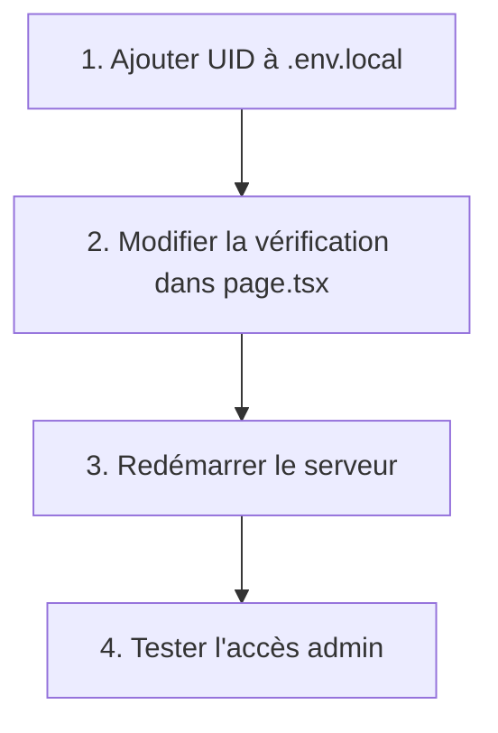

# Plan d'implémentation de l'UID administrateur

**Objectif** : Intégrer l'UID administrateur (3XX4Mqxr16Z4tMzIrs2RDmEh4Iv2) dans le panneau d'administration pour permettre un accès sécurisé sans erreurs.

## Étapes d'implémentation



### 1. Ajouter l'UID administrateur à `.env.local`
- **Fichier**: [`.env.local`](.env.local)
- **Action**: Ajouter la ligne suivante à la fin du fichier :
  ```
  ADMIN_UID=3XX4Mqxr16Z4tMzIrs2RDmEh4Iv2
  ```

### 2. Modifier la vérification d'accès dans le dashboard admin
- **Fichier**: [`app/admin/dashboard/page.tsx`](app/admin/dashboard/page.tsx)
- **Modification**:
  - Remplacer la ligne 257 (contrôle d'accès codé en dur) :
    ```tsx
    const ADMIN_UID = "VOTRE_USER_ID_ADMIN_ICI"; // À remplacer
    ```
  - Par :
    ```tsx
    const ADMIN_UID = process.env.ADMIN_UID || "";
    ```

### 3. Redémarrer le serveur Next.js
- **Commande**:
  ```bash
  npm run dev
  ```
- **Explication**: Les variables d'environnement ne sont chargées qu'au démarrage

### 4. Vérifier l'accès administrateur
1. Se connecter avec le compte correspondant à l'UID
2. Accéder à `/admin/dashboard`
3. Confirmer que :
   - Le panneau admin s'affiche correctement
   - Les signalements sont visibles et actionnables
   - Les autres utilisateurs ne peuvent pas accéder au dashboard

## Fichiers concernés
1. [`.env.local`](.env.local) - Configuration des variables d'environnement
2. [`app/admin/dashboard/page.tsx`](app/admin/dashboard/page.tsx) - Panneau d'administration principal

## Notes importantes
- **Sécurité**: Cette solution est temporaire. Pour une gestion plus robuste :
  - Utiliser une collection Firestore dédiée aux administrateurs
  - Implémenter des rôles utilisateur
- **Environnement**: Le fichier `.env.local` ne doit pas être commit dans le dépôt Git
- **Tests**: Vérifier les erreurs dans la console après implémentation