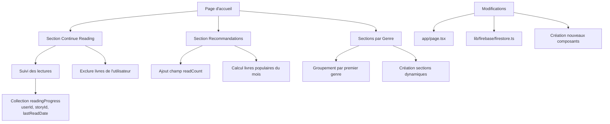

# Plan de refonte de la page d'accueil

## Objectifs
1. Mettre à jour la section "Continue Reading" pour afficher les derniers livres commencés (excluant les créations de l'utilisateur)
2. Remplacer la section "All Stories" par une section "Recommandations" (livres les plus lus du mois)
3. Ajouter des sections par genre littéraire (basées sur le premier genre de chaque livre)

## Diagramme d'architecture


## Étapes d'implémentation

### 1. Préparation des données
- **Ajouter `readCount` aux documents Story** :
  - Champ numérique initialisé à 0
  - Mise à jour via Cloud Function ou script
- **Créer collection `readingProgress`** :
  - Champs : `userId`, `storyId`, `lastReadDate` (timestamp)
  - Index composite pour les requêtes

### 2. Section "Continue Reading"
- **Logique** :
  ```ts
  const getContinueReading = async (userId) => {
    // 1. Récupérer les lectures récentes de l'utilisateur
    // 2. Exclure les livres dont l'utilisateur est l'auteur
    // 3. Trier par lastReadDate (plus récent d'abord)
  }
  ```
- **Composant** : Adapter `ContinueReadingCarousel`

### 3. Section "Recommandations"
- **Logique** :
  ```ts
  const getTopStories = async () => {
    // 1. Filtrer les stories du mois courant
    // 2. Trier par readCount (décroissant)
    // 3. Limiter à 10 résultats
  }
  ```
- **Remplacer** la section "All Stories"

### 4. Sections par genre
- **Logique** :
  ```ts
  const groupByGenre = (stories) => {
    // 1. Extraire le premier genre de chaque story
    // 2. Grouper par genre
    // 3. Créer une section pour chaque genre avec >3 livres
  }
  ```
- **Nouveau composant** : `GenreSection`

### 5. Modifications de l'interface
- **Page d'accueil** :
  - Nouvelle structure :
    ```tsx
    <div>
      <PageHeader />
      <ContinueReadingSection />
      <RecommendationsSection />
      <GenreSections />
    </div>
    ```
- **Responsive design** : Adapter pour mobile

## Échéancier estimé
1. Préparation données (2 jours)
2. Développement back-end (3 jours)
3. Développement front-end (3 jours)
4. Tests et ajustements (2 jours)