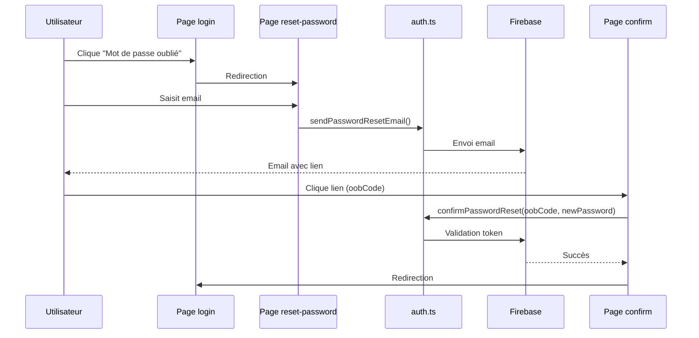

# Plan d'implémentation : Réinitialisation de mot de passe

## Objectif
Permettre aux utilisateurs de réinitialiser leur mot de passe via un lien sécurisé envoyé par email.

## Fichiers impactés
1. `lib/firebase/auth.ts` (nouveau)
2. `app/login/page.tsx` (modification)
3. `app/reset-password/page.tsx` (nouveau)
4. `app/reset-password/confirm/page.tsx` (nouveau)

## Workflow technique


## Détails d'implémentation

### auth.ts
```typescript
import { auth } from './config';
import { FirebaseError } from 'firebase/app';

export const sendPasswordResetEmail = async (email: string) => {
  try {
    await sendPasswordResetEmail(auth, email);
    return { success: true };
  } catch (error) {
    return { error: (error as FirebaseError).message };
  }
};

export const confirmPasswordReset = async (oobCode: string, newPassword: string) => {
  try {
    await confirmPasswordReset(auth, oobCode, newPassword);
    return { success: true };
  } catch (error) {
    return { error: (error as FirebaseError).message };
  }
};
```

### Sécurité
- Liens valables 24h (config Firebase par défaut)
- Validation côté serveur des tokens (oobCode)
- Exigences mot de passe : 8 caractères minimum

### Gestion d'erreurs
| Code erreur | Message utilisateur |
|-------------|---------------------|
| auth/user-not-found | Aucun compte associé à cet email |
| auth/invalid-action-code | Lien expiré ou invalide |
| auth/weak-password | Mot de passe trop faible |

## Tests requis
1. Email non enregistré → Message "Aucun compte associé"
2. Lien expiré → Message "Lien invalide"
3. Nouveau mot de passe faible → Message d'erreur
4. Flux complet réussi → Redirection vers login