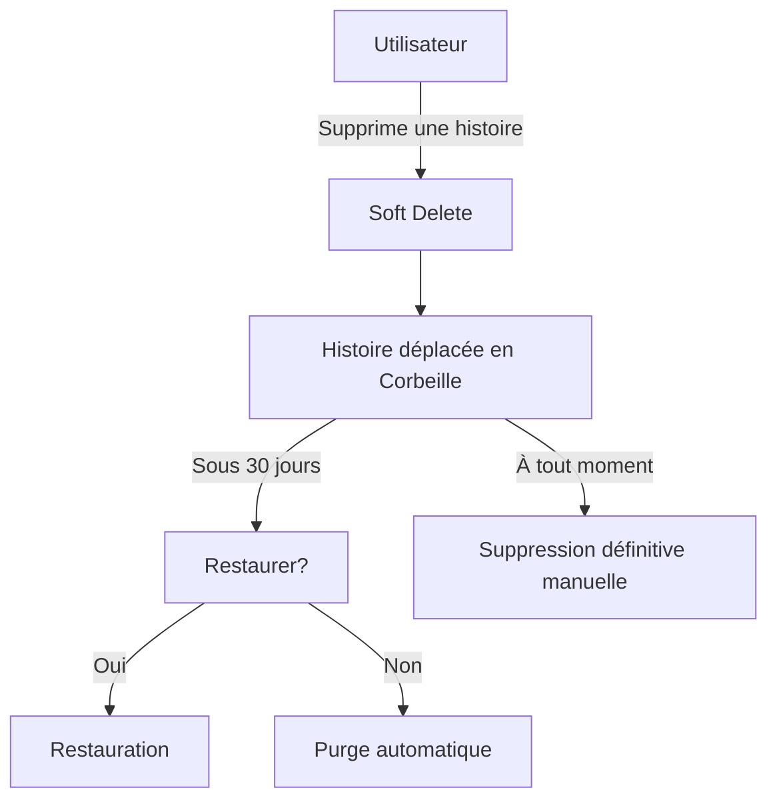

# Plan d'implémentation : Fonctionnalité de suppression avec corbeille

## Objectif
Permettre aux utilisateurs de :
1. Supprimer des histoires dans une corbeille (soft delete)
2. Restaurer des histoires supprimées
3. Vider automatiquement la corbeille après 30 jours
4. Supprimer définitivement des histoires manuellement

## Modifications Backend

### Nouveaux champs dans le modèle Story
```typescript
interface Story {
  // ... champs existants
  deleted: boolean;
  deletedAt?: string; // Timestamp en millisecondes
}
```

### Nouvelles fonctions dans `lib/firebase/firestore.ts`

```typescript
// Marquer une histoire comme supprimée
export async function softDeleteStory(id: string): Promise<void> {
  try {
    const docRef = doc(db, "stories", id);
    await updateDoc(docRef, {
      deleted: true,
      deletedAt: Timestamp.now().toMillis().toString()
    });
  } catch (error) {
    console.error("Error soft-deleting story: ", error);
    throw new Error("Failed to soft-delete story");
  }
}

// Restaurer une histoire supprimée
export async function restoreStory(id: string): Promise<void> {
  try {
    const docRef = doc(db, "stories", id);
    await updateDoc(docRef, {
      deleted: false,
      deletedAt: null
    });
  } catch (error) {
    console.error("Error restoring story: ", error);
    throw new Error("Failed to restore story");
  }
}

// Récupérer les histoires supprimées d'un utilisateur
export async function getDeletedStories(userId: string): Promise<UserStory[]> {
  try {
    const storiesRef = collection(db, 'stories');
    const q = query(
      storiesRef, 
      where('authorId', '==', userId),
      where('deleted', '==', true)
    );
    
    const snapshot = await getDocs(q);
    return snapshot.docs.map(doc => {
      const data = doc.data();
      return {
        id: doc.id,
        title: data.title,
        imageUrl: data.coverImage || "/assets/cover.png",
        commentCount: 0, // À calculer si nécessaire
        averageRating: 0 // À calculer si nécessaire
      };
    });
  } catch (error) {
    console.error("Error getting deleted stories:", error);
    return [];
  }
}

// Purger les histoires supprimées il y a plus de 30 jours
export async function purgeOldStories(): Promise<void> {
  try {
    const threshold = Date.now() - 30 * 24 * 60 * 60 * 1000; // 30 jours
    const storiesRef = collection(db, 'stories');
    const q = query(
      storiesRef, 
      where('deleted', '==', true),
      where('deletedAt', '<', threshold.toString())
    );
    
    const snapshot = await getDocs(q);
    const deletePromises = snapshot.docs.map(doc => deleteDoc(doc.ref));
    await Promise.all(deletePromises);
  } catch (error) {
    console.error("Error purging old stories:", error);
  }
}
```

## Modifications Frontend

### Nouvelle page : Corbeille
`app/my-stories/trash/page.tsx`
```tsx
// Page affichant les histoires supprimées avec options de restauration/suppression définitive
```

### Composant : Carte d'histoire supprimée
`components/cards/deleted-story-card.tsx`
```tsx
// Affiche :
// - Titre et couverture
// - Date de suppression
// - Jours restants avant purge automatique
// - Boutons "Restaurer" et "Supprimer définitivement"
```

### Modifications de la page Mes Histoires
`app/my-stories/page.tsx`
```tsx
// Ajouter :
// - Onglets "Actives" et "Corbeille"
// - Bouton "Vider la corbeille" dans l'onglet Corbeille
// - Logique pour basculer entre les vues
```

## Tâche Cron pour la purge automatique

### Script de purge
`scripts/purge-old-stories.ts`
```typescript
import { purgeOldStories } from '@/lib/firebase/firestore';

async function main() {
  await purgeOldStories();
  process.exit(0);
}

main();
```

### Ajout dans package.json
```json
"scripts": {
  "purge-stories": "ts-node scripts/purge-old-stories.ts"
}
```

### Configuration Cron (à exécuter quotidiennement)
```bash
0 0 * * * npm run purge-stories
```

## Workflow Utilisateur



## Calendrier d'implémentation
1. Phase 1 : Modèles backend et fonctions (2 jours)
2. Phase 2 : Interface utilisateur (3 jours)
3. Phase 3 : Tâches automatisées (1 jour)
4. Phase 4 : Tests et déploiement (2 jours)

## Fichiers impactés
1. `lib/firebase/firestore.ts`
2. `app/my-stories/page.tsx`
3. `app/my-stories/trash/page.tsx`
4. `components/cards/deleted-story-card.tsx`
5. `scripts/purge-old-stories.ts`
6. `package.json`